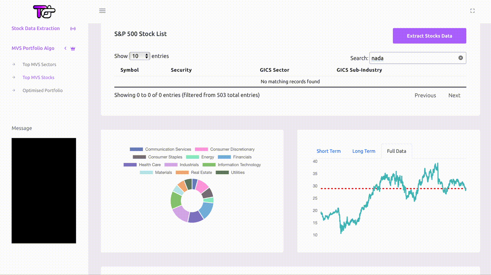

<!-- HEADER -->
<a id="readme-top"></a>

<br />
<div align="center">
  <a href="https://github.com/vinc1am/trading-dash">
    
  </a>

  <h3 align="center">Trading Dash</h3>

  <p align="center">
    Stocks algo-trading, portfolio optimisation, and visualisation
    <br />
  </p>

  [![MIT License][license-shield]][license-url]
  [![LinkedIn][linkedin-shield]][linkedin-url]
  [![Website][website-shield]][website-url]

</div>

<details>
  <summary>Table of Contents</summary>
  <ol>
    <li>
      <a href="#about-the-project">Overview</a>
    </li>
    <li>
      <a href="#getting-started">Installation</a>
    </li>
    <li><a href="#usage">Usage</a></li>
    <li><a href="#roadmap">Roadmap</a></li>
    <li><a href="#license">License</a></li>
    <li><a href="#acknowledgments">Acknowledgments</a></li>
  </ol>
</details>


<!-- Overview -->
## Overview


Trading Dash is a Full Stack trading decision making application that offers stock data extraction, implements momentum algorithmic trading, optimizes portfolios, and provides sophisticated data visualisation.

**Key Features Include:**

* Extraction of **S&P Financial Stock Data** with the use of the yFinance API. This feature provides detailed information such as stock prices, company profiles, and website links.
* Unique capability to **segment stocks** into different clusters based on the correlation of their price changes.
* Evaluation and **ranking of stocks** by their momentum concerning price movements in tandem with standard stock performance filters.
* Portfolio Optimisation.
* Comprehensive **Data Visualisation**.

To get started with the application, execute `app.py`. 


<!-- GETTING STARTED -->
## Getting Started

Here are the instructions on setting up the project locally. To get a local copy up and running, please follow these steps:

### Installation

Below is an example of how you can set up this Flask app. We assume you have Python and Pip installed on your local system.

1. Clone the repo
   ```sh
   git clone https://github.com/vinc1am/trading-dash.git
   ```
2. Go to your project folder and install the required Python packages
   ```sh
   pip install -r requirements.txt
   ```
3. Execute the Flask application
   ```sh
   python app.py
   ```
4. Open your web browser and enter the following in the address bar
   ```sh
   localhost:5000
   ```


<!-- USAGE EXAMPLES -->
## Usage

### Stock Data Extraction
The extraction of S&P Financial Stock Data via yFinance API allows for obtaining raw data in short/long term or full batches, presenting GICS Sector distribution through pie charts, visualizing price changes, providing company summaries, and enabling efficient stock search functions.



### Find the Top Sectors & Stocks

This feature segments stocks into clusters based on correlated price changes. Stocks are grouped by correlation, ranked by price momentum, allowing users to identify top-performing sectors and calculate individual stock momentum within them.


### Portfolio Optimisation
Using Average True Range and Modern Portfolio Theory, this feature provides an optimized portfolio of select stocks. Upon entering their investment amount, users get an optimized fund distribution across these stocks.


<!-- ROADMAP -->
## Roadmap

- [x] Stock Data Extraction using yFinance
- [x] Stocks Segmentation based on their price change correlation
- [x] Apply Momentum Strategy to rank the Sectors and Stocks
- [x] Portfolio Optimisation
- [x] User Interface
- [x] Data Visualisation


<!-- LICENSE -->
## License

Distributed under the MIT License. See `LICENSE.txt` for more information.


<!-- ACKNOWLEDGMENTS -->
## Acknowledgments

This project would not have been possible without the valuable resources and insights derived from the following sources:


* [Stocks on the Move](https://www.amazon.com/gp/product/1511466146/ref=as_li_qf_asin_il_tl?ie=UTF8&tag=teddykoker-20&creative=9325&linkCode=as2&creativeASIN=1511466146&linkId=92abe2e8f3dd2c9b9cc7d23fa6693dc5)
* [Teddy Koker Blog](https://teddykoker.com/2019/05/momentum-strategy-from-stocks-on-the-move-in-python/)

<p align="right" style="font-family:verdana;font-size:80%;color:blue"><b><a href="#readme-top" >Back to Top</a></b></p>


<!-- MARKDOWN LINKS & IMAGES -->
[license-shield]: https://img.shields.io/badge/License-MIT-yellow.svg
[license-url]: https://opensource.org/licenses/MIT
[website-shield]: https://img.shields.io/badge/Website-blue.svg
[website-url]: https://www.vinc1am.com
[linkedin-shield]: https://img.shields.io/badge/LinkedIn-blue.svg
[linkedin-url]: https://www.linkedin.com/in/vinc1am/

